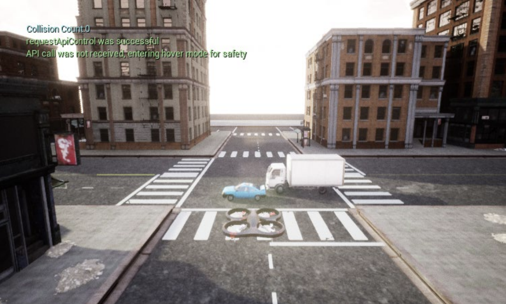
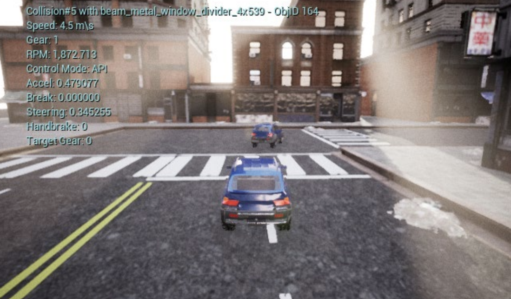

# Image Attack to Vision Guided Autonomous Vehicles

## The following three videos demonstrate online image attack (click the images for the videos)
- The following videos show the performance of the image attack after **several hours** of training, using the simulation environments.

## The image attack method was implemented with a small UAV.
### Implementation of the online training using ROS  

- The goal of the online image training is to crash the UAV by teaching to fabricate the bounding box.
- Unlike the simulation environment, we cannot run many training episodes because of the limited battery capacity and hardware damages due to collision. Therefore, we ran a single training episode.
- In the video linked below, the online training took only **two minutes** until the UAV crashed.

Link to the video is (https://youtu.be/0f4zvl3XOek?t=66).  Please, wait until the UAV crashes.

