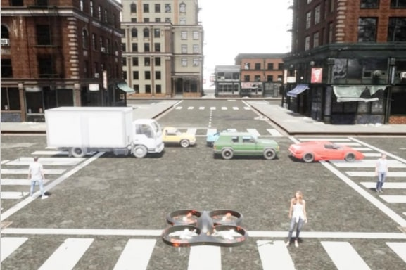
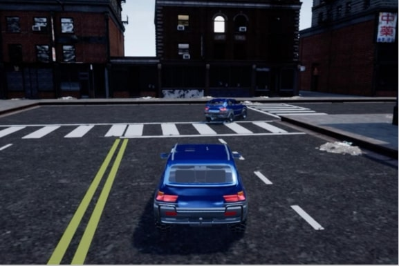
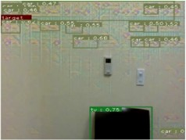

# Image Attack to Vision Guided Autonomous Vehicles

## The following three videos demonstrate online image attack

## We aim to carry over the online image attack method to the following robotic platform.

## First image attack with the image stream collected from Tello

